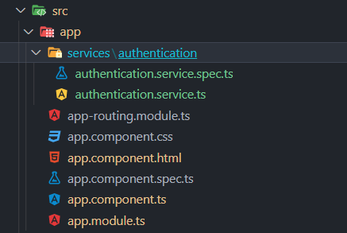

# 5. Getting started with Firebase Authentication

#### This documentation works for Modular Firebase V9+

First initialize firebase authentication in `app.module.ts`

```typescript
@NgModule({
  declarations: [AppComponent],
  imports: [provideAuth(() => getAuth())],
  providers: [ScreenTrackingService, UserTrackingService],
  bootstrap: [AppComponent],
})
export class AppModule {}
```

#### A basic authentication demo code.

```typescript
import { Component } from "@angular/core";
import {
  Auth,
  authState,
  GoogleAuthProvider,
  signInWithPopup,
  signOut,
  UserCredential,
} from "@angular/fire/auth";
import { map } from "rxjs";
@Component({
  selector: "app-root",
  template: `
    <div *ngIf="loggedIn">
      <h1>Hello {{ user.displayName }}!</h1>
      <button (click)="logout()">Logout</button>
    </div>

    <div *ngIf="!loggedIn">
      <p>Please login.</p>
      <button (click)="login()">Login with Google</button>
    </div>
  `,
})
export class AppComponent {
  title = "AngularFireDevelopment";
  user: any;
  public loggedIn: boolean = false;
  constructor(private auth: Auth) {
    authState(this.auth)
      .pipe(map((u) => u))
      .subscribe((userData) => {
        this.user = userData;
        this.loggedIn = !!userData;
      });
  }
  login() {
    signInWithPopup(this.auth, new GoogleAuthProvider()).then(
      async (credentials: UserCredential) => {
        this.user = credentials.user;
      }
    );
  }
  logout() {
    return signOut(this.auth);
  }
}
```

It is a good practice to keep your local code away from component code. So let's create a service file inside our

`ng generate service services/authentication/authentication`

It should create a file like this. This file is known as service.
[More on services here.](https://angular.io/tutorial/toh-pt4)



Now add these functions in your services

This is for logging in with google.

```typescript
googleLogin(){
    signInWithPopup(this.auth, new GoogleAuthProvider()).then(
      async (credentials: UserCredential) => {
        this.user = credentials.user;
      }
    );
  }
```

This is for logging in with email and password it takes two arguments email and password.

```typescript
emailLogin(email:string,password:string){
    return signInWithEmailAndPassword(this.auth,email,password)
  }
```

This is for creating account with an email and password

#### Please verify and check for all password requirements using form validation firebase does not qualifications for secure password and valid emails.

```typescript
emailSignup(email:string,password:string){
    return createUserWithEmailAndPassword(this.auth,email,password)
  }
```

This method logs you out of any or all account for current user instance

```typescript
logout() {
    return signOut(this.auth);
  }
```

This methods signs you in anonymously.

```typescript
anonymousSignIn(){
    return signInAnonymously(this.auth);
  }
```

#### The final service file

`authentication.service.ts`

```typescript
import { Injectable } from "@angular/core";
import {
  Auth,
  GoogleAuthProvider,
  signInWithPopup,
  signOut,
  UserCredential,
} from "@angular/fire/auth";
import {
  createUserWithEmailAndPassword,
  signInAnonymously,
  signInWithEmailAndPassword,
} from "firebase/auth";

@Injectable({
  providedIn: "root",
})
export class AuthenticationService {
  user: any;
  constructor(private auth: Auth) {}
  googleLogin() {
    signInWithPopup(this.auth, new GoogleAuthProvider()).then(
      async (credentials: UserCredential) => {
        this.user = credentials.user;
      }
    );
  }
  emailLogin(email: string, password: string) {
    return signInWithEmailAndPassword(this.auth, email, password);
  }
  emailSignup(email: string, password: string) {
    return createUserWithEmailAndPassword(this.auth, email, password);
  }
  logout() {
    return signOut(this.auth);
  }
  anonymousSignIn() {
    return signInAnonymously(this.auth);
  }
}
```

Now in your `app.component.ts` add this code to immport our `AuthenticationService` file we just created.

`app.component.ts`

```typescript
import { Component } from '@angular/core';
import { FormControl, FormControlName, FormGroup, Validators } from '@angular/forms';
import { AuthenticationService } from './services/authentication/authentication.service';
@Component({
  selector: 'app-root',
  templateUrl: './app.component.html',
  styleUrls: ['./app.component.css']
})
export class AppComponent {
  title = 'AngularFireDevelopment';
  constructor(public authService:AuthenticationService){}
  signIn:FormGroup = new FormGroup({
    email:new FormControl('',[Validators.required]),
    password:new FormControl('',[Validators.required])
  });
  signUp:FormGroup = new FormGroup({
    email:new FormControl('',[Validators.required]),
    password:new FormControl('',[Validators.required])
  });
  login(){
    if(this.signIn.valid){
      this.authService.emailLogin(this.signIn.value.email,this.signIn.value.password)
      .then(()=>alert('Signed In'))
      .catch((error)=>alert('Invalid Sign In'+error.toString()));
    } else {
      alert('Invalid Login Form');
    }
  }
  signup(){
    if(this.signUp.valid){
      this.authService.emailSignup(this.signUp.value.email,this.signUp.value.password)
      .then(()=>alert('Signed up'))
      .catch((error:any)=>alert('Invalid Sign Up'+error.toString()));
    } else {
      alert('Invalid Signup Form');
    }
  }
}

```

Now add `FormsModule` and `ReactiveFormsModule` to your app module imports.

```typescript
imports:
[
  FormsModule,
  ReactiveFormsModule,
]
```

And your `app.component.html` file which will have only UI code but will be able to access the authentication service using Injection

`app.component.html`

```html
<div *ngIf="authService.loggedIn">
  <h1>Hello {{ authService.user.displayName }}!</h1>
  <button (click)="authService.logout()">Logout</button>
</div>

<div *ngIf="!authService.loggedIn">
  <p>Please login.</p>
  <button (click)="authService.googleLogin()">Login with Google</button>
  <div>
    <form [formGroup]="signIn">
      <input type="text" formControlName="email" placeholder="Email">
      <input type="text" formControlName="password" placeholder="Password">
      <button (click)="login()">Login with Email And Password</button>
    </form>
  </div>
  <div>
    <form [formGroup]="signUp">
      <input type="text" formControlName="email" placeholder="Email">
      <input type="text" formControlName="password" placeholder="Password">
      <button (click)="signup()">Signup with Email And Password</button>
    </form>
  </div>
</div>
```

#### Full repo [link here](https://github.com/Sapython/AngularFireDevelopment)

### Now you just learned how to do authentication with firebase.

---


## Configuration with Dependency Injection

The AngularFireAuth Module provides several DI tokens to further configure your
authentication process.

### Configure 

Using the `SETTINGS` DI Token (*default: null*), we can set the current Auth
instance's settings. This is used to edit/read configuration related options
like app verification mode for phone authentication, which is useful for
[testing](https://cloud.google.com/identity-platform/docs/test-phone-numbers).

```ts
import { SETTINGS as AUTH_SETTINGS } from '@angular/fire/compat/auth';

@NgModule({
  // ... Existing configuration
  providers: [
    // ... Existing Providers
    { provide: AUTH_SETTINGS, useValue: { appVerificationDisabledForTesting: true } },
  ]
})
export class AppModule { }
```

Read more at [Firebase Auth Settings](https://firebase.google.com/docs/reference/js/firebase.auth.AuthSettings).

### Use Current Browser Language

Using the `USE_DEVICE_LANGUAGE` DI Token (*default: null*), which is a boolean
that allow you to set the current language to the default device/browser
preference. This allows to localize emails but be aware that this only applies
if you use the standard template provided by Firebase. 

```ts
import { USE_DEVICE_LANGUAGE } from '@angular/fire/compat/auth';

@NgModule({
  // ... Existing configuration
  providers: [
    // ... Existing Providers
    { provide: USE_DEVICE_LANGUAGE, useValue: true },
  ]
})
export class AppModule { }
```

If you want to set a different language, you can use `LANGUAGE_CODE` DI Token
(*default: null*).

More info at the [firebase auth docs](https://firebase.google.com/docs/reference/js/firebase.auth.Auth#languagecode).

```ts
import { LANGUAGE_CODE } from '@angular/fire/compat/auth';

@NgModule({
  // ... Existing configuration
  providers: [
    // ... Existing Providers
    { provide: LANGUAGE_CODE, useValue: 'fr' },
  ]
})
export class AppModule { }
```

### Persistence

Firebase Auth default behavior is to persist a user's session even after the
user closes the browser. To change the current type of persistence on the
current Auth instance for the currently saved Auth session and apply this type
of persistence for future sign-in requests, including sign-in with redirect
requests, you can use the `PERSISTENCE` DI Token (*default: null*).

The possible types are `'local'`, `'session'` or `'none'`. Read more at 
[authentication state persistence](https://firebase.google.com/docs/auth/web/auth-state-persistence),

```ts
import { PERSISTENCE } from '@angular/fire/compat/auth';

@NgModule({
  // ... Existing configuration
  providers: [
    // ... Existing Providers
    { provide: PERSISTENCE, useValue: 'session' },
  ]
})
export class AppModule { }
```

### Tenant

If you need to use multi-tenancy, you can set the current Auth instance's tenant
ID using `TENANT_ID` DI Token (*default: null*).

More tutorials regarding this topic are _coming soon_.

```ts
import { TENANT_ID } from '@angular/fire/compat/auth';

@NgModule({
  // ... Existing configuration
  providers: [
    // ... Existing Providers
    { provide: TENANT_ID, useValue: 'tenant-id-app-one' },
  ]
})
export class AppModule { }
```

- [Multi-Tenancy Authentication](https://cloud.google.com/identity-platform/docs/multi-tenancy-authentication)
- [Firebase Auth Tenant](https://firebase.google.com/docs/reference/js/firebase.auth.Auth#tenantid)

## UI Libraries

- Material Design : [ngx-auth-firebaseui](https://github.com/AnthonyNahas/ngx-auth-firebaseui)
- Bootstrap : [@firebaseui/ng-bootstrap](https://github.com/firebaseui/ng-bootstrap)

## Cordova

Learn how to [setup Firebase Authentication with Cordova](https://firebase.google.com/docs/auth/web/cordova) in the Firebase Guides.
