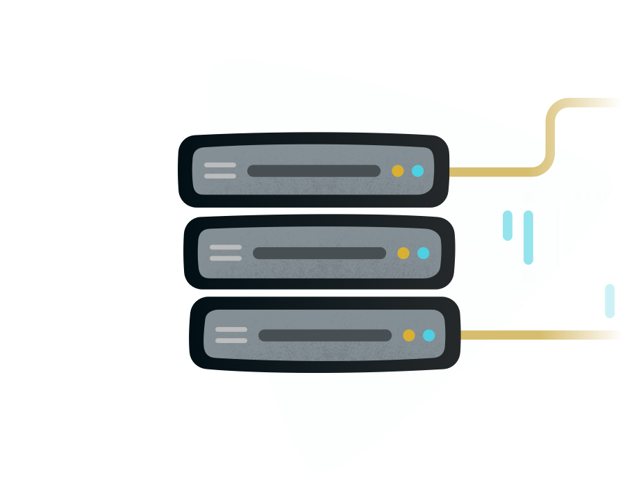

<small>
<a href="https://github.com/angular/angularfire">AngularFire</a> &#10097; <a href="../README.md#developer-guide">Developer Guide</a> &#10097; Realtime Database
</small>

# Realtime Database

Store and sync data with our NoSQL cloud database. Data is synced across all clients in realtime, and remains available when your app goes offline.

The Firebase Realtime Database is a cloud-hosted database. Data is stored as JSON and synchronized in realtime to every connected client. When you build cross-platform apps with our iOS, Android, and JavaScript SDKs, all of your clients share one Realtime Database instance and automatically receive updates with the newest data. [Learn more about the Realtime Database](https://firebase.google.com/docs/database).

## Dependency Injection

AngularFire allows you to work with the Realtime Database via Angular's Dependency Injection.

First provide a RTDB instance to AngularFire:

```ts
import { provideFirebaseApp, initializeApp } from '@angular/fire/app';
import { getDatabase, provideDatabase } from '@angular/fire/database';

@NgModule({
  imports: [
    provideFirebaseApp(() => initializeApp(environment.firebase)),
    provideDatabase(() => getDatabase()),
  ]
})
```

Next inject it into your component:

```ts
import { Database } from '@angular/fire/database';

constructor(database: Database) {
}
```

## Firebase API

AngularFire wraps the Firebase JS SDK to ensure proper functionality in Angular, while providing the same API.

Just change your imports from `import { ... } from 'firebase/database'` to `import { ... } from '@angular/fire/database'` and follow the offical documentation.

[Getting Started](https://firebase.google.com/docs/database/web/start) | [API Reference](https://firebase.google.com/docs/reference/js/database)

## Convenience observables

AngularFire provides observables to allow convenient use of the Realtime Database with RXJS.

### `object`

The `object()` function creates an observable that emits object changes.

|                 |                                          |
|-----------------|------------------------------------------|
| **function**    | `object(ref)`                               |
| **params**      | ref: `Reference`  |
| **return**      | `Observable<QueryChange>`                |

### `objectVal`

TBD

### `list`

The `list()` function creates an observable that emits a sorted array for each child event change. The optional `events` parameter will filter which child events populate the array.

|                 |                                                       |
|-----------------|-------------------------------------------------------|
| **function**    | `list(ref, options?)`                                              |
| **params**      | ref: `Reference\|Query`, options?: { events?: `ListenEvent[]` } |
| **return**      | `Observable<QueryChange[]>`                           |

### `listVal`

TBD

### `stateChanges`


The `stateChanges()` function creates an observable that emits each time a change occurs at the reference or query passed. This is useful for tracking the changes in your list. The optional `events` parameter will filter which child events populate the array.

|                 |                                                      |
|-----------------|------------------------------------------------------|
| **function**    | `stateChanges(ref, options?)`                                     |
| **params**      | ref: `Reference\|Query`, options:? { events?: `ListenEvent[]` } |
| **return**      | `Observable<QueryChange>`                          |

### `auditTrail`

The `auditTrail()` function creates an observable that emits the entire state trail. This is useful for debugging or replaying the state of a list in your app. The optional `events` parameter will filter which child events populate the array.

|                 |                                                      |
|-----------------|------------------------------------------------------|
| **function**    | `auditTrail(ref, options?)`                                       |
| **params**      | ref: `Reference\|Query`, options?: { events?: `ListenEvent[]` } |
| **return**      | `Observable<QueryChange[]>`                          |

### `fromRef`

The `fromRef()` function creates an observable that emits reference changes.

|                 |                                          |
|-----------------|------------------------------------------|
| **function**    | `fromRef(ref, event)`                              |
| **params**      | ref: `Reference\|Query`, event: `ListenEvent` |
| **return**      | `Observable<QueryChange>`                |

## Connecting the the emulator suite

```ts
import { connectDatabaseEmulator, getDatabase, provideDatabase } from '@angular/fire/database';

@NgModule({
  imports: [
    provideDatabase(() => {
      const database = getDatabase();
      connectDatabaseEmulator(database, 'localhost', 9000);
      return database;
    }),
  ]
})
```

## Working with multiple instances

```ts
import { provideFirebaseApp, FirebaseApp, initializeApp } from '@angular/fire/app';
import { getDatabase, provideDatabase } from '@angular/fire/database';

const DATABASE_SHARD_URLS = [
  'https://FOO.firebaseio.com',
  'https://BAR.firebaseio.com',
  'https://BAZ.firebaseio.com',
];

@NgModule({
  imports: [
    provideFirebaseApp(() => initializeApp(environment.firebase)),
    provideDatabase((app: FirebaseApp) => getDatabase(app, DATABASE_SHARD_URLS[0])),
    provideDatabase((app: FirebaseApp) => getDatabase(app, DATABASE_SHARD_URLS[1])),
    provideDatabase((app: FirebaseApp) => getDatabase(app, DATABASE_SHARD_URLS[2])),
  ]
})
```

```ts
import { DatabaseInstances } from '@angular/fire/database';

constructor(databases: DatabaseInstances) {
 // databases => Database[]
}
```
