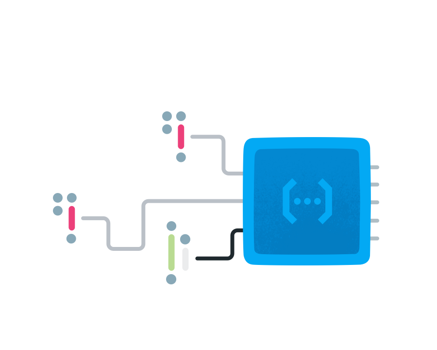

<small>
<a href="https://github.com/angular/angularfire">AngularFire</a> &#10097; <a href="../README.md#developer-guide">Developer Guide</a> &#10097; Cloud Functions
</small>

# Cloud Functions

The Cloud Functions for Firebase client SDKs let you call functions directly from a Firebase app. To call a function from your app in this way, write and deploy an HTTPS Callable function in Cloud Functions, and then add client logic to call the function from your app.

[Learn More](https://firebase.google.com/docs/functions/get-started)

## Dependency Injection

As a prerequisite, ensure that `AngularFire` has been added to your project via
```bash
ng add @angular/fire
```

Provide a Cloud Functions instance in the application's `app.config.ts`:

```ts
import { provideFirebaseApp, initializeApp } from '@angular/fire/app';
import { provideFunctions, getFunctions } from '@angular/fire/functions';

export const appConfig: ApplicationConfig = {
  providers: [
    provideFirebaseApp(() => initializeApp({ ... })),
    provideFunctions(() => getFunctions()),
    ...
  ],
  ...
})
```

Next inject `Functions` into your component:

```ts
import { Component, inject} from '@angular/core';
import { Functions } from '@angular/fire/functions';

@Component({ ... })
export class AppComponent {
  private functions = inject(Functions);
  ...
}
```

## Firebase API

AngularFire wraps the Firebase JS SDK to ensure proper functionality in Angular, while providing the same API.

Update the imports from `import { ... } from 'firebase/functions'` to `import { ... } from '@angular/fire/functions'` and follow the official documentation.

[Call functions from your app](https://firebase.google.com/docs/functions/callable?gen=2nd#web-modular-api) | [API Reference](https://firebase.google.com/docs/reference/js/functions)
