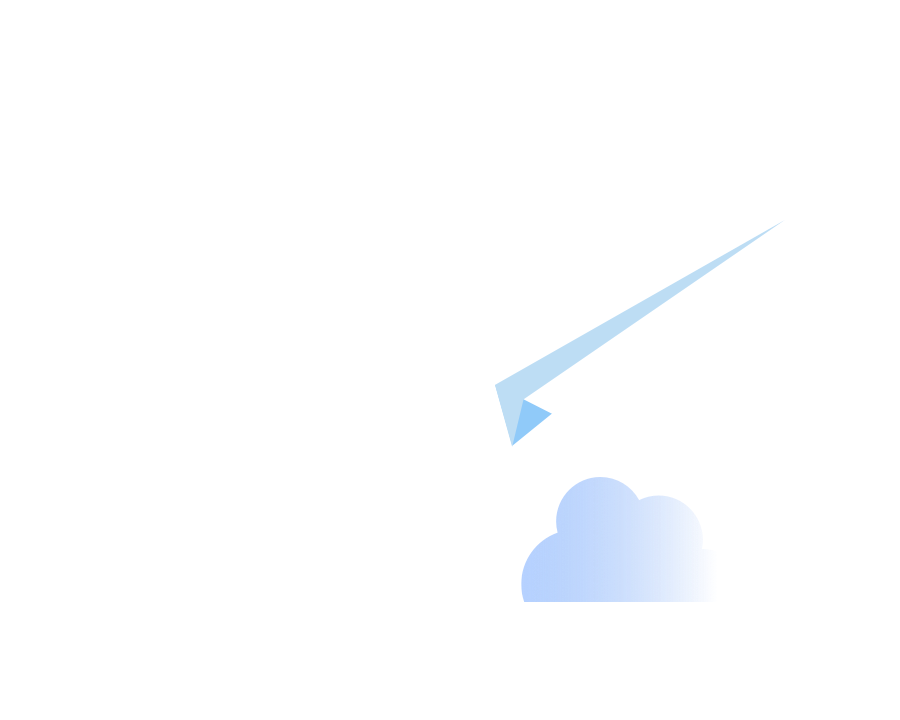

<small>
<a href="https://github.com/angular/angularfire">AngularFire</a> &#10097; <a href="../README.md#developer-guide">Developer Guide</a> &#10097; Cloud Messaging
</small>

# Cloud Messaging

Firebase FCM allows you to register devices with unique FCM tokens, that you can later programtically send notifications to using Firebase Cloud Functions. It is up to the application to update these tokens in Firebase if you want to use them in other layers of your application, i.e send a notification to all administrators, etc. In that case, you would likely want to store your fcm tokens on your user collection, or a sub collection or another collection with different permissions.

## Dependency Injection

As a prerequisite, ensure that `AngularFire` has been added to your project via
```bash
ng add @angular/fire
```

Provide a Cloud Messaging instance in the application's `app.config.ts`:

```ts
import { provideFirebaseApp, initializeApp } from '@angular/fire/app';
import { provideMessaging, getMessaging } from '@angular/fire/messaging';

export const appConfig: ApplicationConfig = {
  providers: [
    provideFirebaseApp(() => initializeApp({ ... })),
    provideMessaging(() => getMessaging()),
    ...
  ],
  ...
})
```

Next inject `Messaging` into your component:

```ts
import { Component, inject} from '@angular/core';
import { Messaging } from '@angular/fire/messaging';

@Component({ ... })
export class AppComponent {
  private messaging = inject(Messaging);
  ...
}
```

# Create a Firebase Messaging Service Worker 

There are two parts to Firebase Messaging, a Service Worker and the DOM API. Angular Fire Messaging allows you to request permission, get tokens, delete tokens, and subscribe to messages on the DOM side. To register to receive notifications you need to set up the Service Worker. [The official Firebase documentation for setting up the details exactly how to do that](https://firebase.google.com/docs/cloud-messaging/js/client).

#### Create your firebase-messaging-sw.js file in your src/assets folder

*Note: When copying the below file, make sure your firebase version in your installation matches the version your are importing from below*

It may be wise to use file replacements or environments here for different environments

```
// This sample application is using 9.22, make sure you are importing the same version

import { initializeApp } from "https://www.gstatic.com/firebasejs/9.22.0/firebase-app.js";
import { getMessaging } from "https://www.gstatic.com/firebasejs/9.22.0/firebase-messaging-sw.js";

const firebaseApp = initializeApp({
  apiKey: "",
  authDomain: "",
  projectId: "",
  storageBucket: "",
  messagingSenderId: "",
  appId: "",
});

const messaging = getMessaging(firebaseApp);
```

# Example messaging service

```
import { Injectable } from "@angular/core";
import { Messaging, getToken, onMessage, deleteToken } from "@angular/fire/messaging";
import { Observable, tap } from "rxjs";

@Injectable({
  providedIn: "root",
})
export class FcmService {
  constructor(private msg: Messaging){
    Notification.requestPermission().then(
    (notificationPermissions: NotificationPermission) => {
      if (notificationPermissions === "granted") {
        console.log("Granted");
      }
      if (notificationPermissions === "denied") {
        console.log("Denied");
      }
    });
    navigator.serviceWorker
      .register("/assets/firebase-messaging-sw.js", {
        type: "module",
      })
      .then((serviceWorkerRegistration) => {
        getToken(this.msg, {
          vapidKey: `an optional key generated on Firebase for your fcm tokens`,
          serviceWorkerRegistration: serviceWorkerRegistration,
        }).then((x) => {
          console.log('my fcm token', x);
          // This is a good place to then store it on your database for each user
        });
	});  
    }
    this.message$ = new Observable((sub) => onMessage(this.msg, (msg) =>     
      sub.next(msg))).pipe(
	    tap((msg) => {
	      console.log("My Firebase Cloud Message", msg);
	    })
    );
    }
  deleteToken(){
    // We can also delete fcm tokens, make sure to also update this on your firestore db if you are storing them as well
    await deleteToken(this.msg);
  }
```

# Testing and Sending Notifications

Firebase will allow you to send a test notification under Engage > Messaging > New Campaign > Notifications. Here you can click send a test message. Additionally, you can send them programmatically through Firebase cloud functions. 

Here is a barebones Node example:

```
export const sendTestMessage = onRequest(async (_, res) => {
  try {
    const message = {
      notification: {
        title: "Test Title",
        body: "Test Body",
      },
      token: "your token here, you can store these and retreive as you please",
    };
    await admin.messaging().send(message);
    res.sendStatus(200);
  } catch (error) {
    console.error(error);
    res.sendStatus(500);
  }
});
```

Here is a Node example that listens for a new comment on a collection, then sends a notification, and also adds it to a cache on Firebase so users can click through them.

```
exports.onPostReply =
  onDocumentCreated("comments/{commentId}", async (event) => {
    if (!event) throw new Error("No event found for document creation");
    const snapshot = event.data;
    if (!snapshot) {
      throw new Error("No data associated with the event");
    }
    const data = snapshot.data();
    if (!data.postId) {
      throw new Error("No post ID found");
    }
    const postRef = await firestore.collection("posts").doc(data.postId).get();
    const postData = postRef.data();
    if (!postData) {
      throw new Error("No postData found");
    }
    // userUid will be the post author's id.
    const {userUid} = postData;
    if (!userUid) {
      throw new Error(
        "Could not find the userUid for the post author for post reply"
      );
    }
    const messageForNotification = {
      title: "You have a new reply on your post",
      body: "",
    };
    await createNotificationAndCache(messageForNotification, userUid);
  });

  // If you want to cache notifications a number of times, abstracting this
  // to a function can bring a lot of value.
  
interface NotificationProps {
  title: string;
  body: string;
}

async function createNotificationAndCache(
  notificationProps: NotificationProps, userAuthUid: string) {
  const userRef = await firestore.collection("users").where("authUid", "==",
    userAuthUid).get();
  const userData = userRef.docs[0].data();

  const promises: Promise<any>[] = [];
  // This sample application has seperate fcm tokens for web and mobile
  if (userData.mobileToken) {
    const message = {
      notification: notificationProps,
      token: userData.mobileToken,
    };
    const promise = admin.messaging().send(message);
    promises.push(promise);
  }
  if (userData.webToken) {
    const message = {
      notification: notificationProps,
      token: userData.webToken,
    };
    const promise = admin.messaging().send(message);
    promises.push(promise);
  }

  const notificationCacheValue = {
    userAuthUid: userAuthUid,
    tokenTitle: notificationProps.title,
    tokenBody: notificationProps.body,
    isActive: true, // This determines whether a notification has been seen
  };

  promises.push(
    firestore.collection("notificationCache").add(notificationCacheValue));

  await Promise.all(promises);
}  ```
