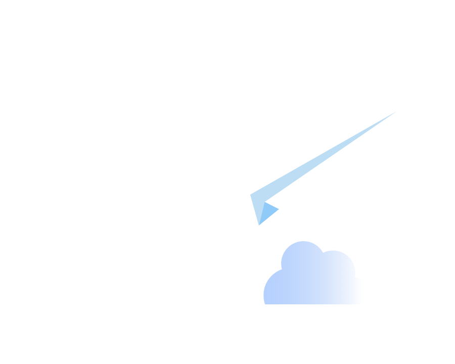

<small>
<a href="https://github.com/angular/angularfire">AngularFire</a> &#10097; <a href="../README.md#developer-guide">Developer Guide</a> &#10097; Cloud Messaging
</small>

# Cloud Messaging

Firebase Cloud Messaging (FCM) allows you to register devices with unique FCM tokens, that you can later programatically send notifications to using Firebase Cloud Functions. It is up to the application to update these tokens in Firebase if you want to use them in other layers of your application, i.e send a notification to all administrators, etc. In that case, you would likely want to store your fcm tokens on your user collection, or a sub collection or another collection with different permissions.

## Dependency Injection

As a prerequisite, ensure that `AngularFire` has been added to your project via
```bash
ng add @angular/fire
```

Provide a Cloud Messaging instance in the application's `app.config.ts`:

```ts
import { ApplicationConfig } from '@angular/core';
import { provideFirebaseApp, initializeApp } from '@angular/fire/app';
import { provideMessaging, getMessaging } from '@angular/fire/messaging';

export const appConfig: ApplicationConfig = {
  providers: [
    provideFirebaseApp(() => initializeApp({ ... })),
    provideMessaging(() => getMessaging()),
    ...
  ],
  ...
}
```

Next inject `Messaging` into your component:

```ts
import { Component, inject} from '@angular/core';
import { Messaging } from '@angular/fire/messaging';

@Component({ ... })
export class AppComponent {
  private messaging = inject(Messaging);
  ...
}
```

# Create a Firebase Messaging Service Worker 

There are two parts to Firebase Messaging, a Service Worker and the DOM API. Angular Fire Messaging allows you to request permission, register this app instance, observe when it is registered or unregistered, and subscribe to messages on the DOM side. To register to receive notifications you need to set up the Service Worker. [The official Firebase documentation for setting up the details exactly how to do that](https://firebase.google.com/docs/cloud-messaging/js/client).

#### Create your firebase-messaging-sw.js file in your src/assets folder

*Note: When copying the below file, make sure your firebase version in your installation matches the version your are importing from below*

It may be wise to use file replacements or environments here for different environments

```js
/* Replace <firebase-version> with the firebase version in your package.json. The service
 * worker and your application have to load the same version. */

import { initializeApp } from "https://www.gstatic.com/firebasejs/<firebase-version>/firebase-app.js";
import { getMessaging } from "https://www.gstatic.com/firebasejs/<firebase-version>/firebase-messaging-sw.js";

const firebaseApp = initializeApp({
  apiKey: "",
  authDomain: "",
  projectId: "",
  storageBucket: "",
  messagingSenderId: "",
  appId: "",
});

const messaging = getMessaging(firebaseApp);
```

# Registering this app instance

Firebase deprecated `getToken` and `deleteToken` in firebase 12.18 and will remove them. Use `register` with `onRegistered` in place of `getToken`, and `unregister` with `onUnregistered` in place of `deleteToken`. [Firebase's client guide](https://firebase.google.com/docs/cloud-messaging/js/client) describes the model and asks that you not mix the two sets.

Three things to know before you copy the example below:

- `onRegistered` has to be listening before `register` runs, which is why the example subscribes first. Otherwise `register` throws `No onRegistered callback handler was provided or registered.`
- **Ask for notification permission yourself before calling `register`,** as the example does. Otherwise `register` asks for you from inside a call AngularFire wraps, which holds the client app unstable until the dialog is dismissed.
  - That delays Angular event replay and clearing the server-rendered DOM, and logs a development-only warning after ten seconds. Asking first avoids all of it.
  - This behavior may change in a future release.
- The identifier reaches you through a callback rather than as a return value, and again whenever it changes, so store it from inside the callback rather than once at startup.

# Example messaging service

```ts
import { EnvironmentInjector, Injectable, inject, runInInjectionContext } from "@angular/core";
import { Messaging, MessagePayload, onMessage, onRegistered, onUnregistered, register, unregister } from "@angular/fire/messaging";
import { Observable, tap } from "rxjs";

@Injectable({ providedIn: "root" })
export class FcmService {
  private readonly injector = inject(EnvironmentInjector);
  /* `onMessage` converted to an observable. Returns the unsubscribe function returned by
   * `onMessage` to stop the listener when the last subscriber unsubscribes. */
  message$ = new Observable<MessagePayload>(
    subscriber => onMessage(this.msg, (msg) => subscriber.next(msg))
  ).pipe(tap((msg) => console.log("My Firebase Cloud Message", msg)));

  constructor(private msg: Messaging) {
    // Set listeners before calling `register` to avoid throwing.
    this.listenForRegistrationChanges();
    this.registerForMessages();
  }

  private listenForRegistrationChanges() {
    onRegistered(this.msg, (installationId) => {
      /* This is a good place to store it in your database for each user.
       * This callback fires whenever `installationId` changes. */
      console.log("my installation id", installationId);
    });

    onUnregistered(this.msg, (installationId) => {
      // Drop it from your database. Sending messages to an unregistered ID results in a 404.
      console.log("no longer registered", installationId);
    });
  }

  private async registerForMessages() {
    /* Request notification permission before calling `register`, otherwise
     * `register` holds the app unstable until the user answers. */
    if (
      Notification.permission === "default" &&
      await Notification.requestPermission() !== "granted"
    ) {
      return;
    }

    // Register the service worker.
    const serviceWorkerRegistration = await navigator.serviceWorker
      .register("/assets/firebase-messaging-sw.js", { type: "module" });

    /* Run `register` inside an injection context. Outside one AngularFire cannot wrap it, and
     * warns. See `zones.md` for what wrapping adds. */
    runInInjectionContext(this.injector, () =>
      register(this.msg, {
        vapidKey: `an optional public VAPID key you generate for your Firebase project`,
        serviceWorkerRegistration,
      }).catch((error) => console.error("could not register for messages", error))
    );
  }

  // Called from your app, for example when a user turns notifications off.
  async unregister() {
    // This calls the imported unregister, not this method. Class methods are not in lexical scope.
    await unregister(this.msg);
  }
}
```

# Testing and Sending Notifications

Firebase will allow you to send a test notification under Engage > Messaging > New Campaign > Notifications. Here you can click send a test message. Additionally, you can send them programmatically through Firebase cloud functions. 

Here is a barebones Node example. Its `token` field still accepts a Firebase Installation ID during the migration, so it works whether you registered with `getToken` or with `register`. Firebase's [Admin SDK send guide](https://firebase.google.com/docs/cloud-messaging/send/admin-sdk) documents a dedicated `fid` field to move to.

```ts
export const sendTestMessage = onRequest(async (_, res) => {
  try {
    const message = {
      notification: {
        title: "Test Title",
        body: "Test Body",
      },
      token: "your token here, you can store these and retreive as you please",
    };
    await admin.messaging().send(message);
    res.sendStatus(200);
  } catch (error) {
    console.error(error);
    res.sendStatus(500);
  }
});
```

Here is a Node example that listens for a new comment on a collection, then sends a notification, and also adds it to a cache on Firebase so users can click through them.

```ts
exports.onPostReply =
  onDocumentCreated("comments/{commentId}", async (event) => {
    if (!event) throw new Error("No event found for document creation");
    const snapshot = event.data;
    if (!snapshot) {
      throw new Error("No data associated with the event");
    }
    const data = snapshot.data();
    if (!data.postId) {
      throw new Error("No post ID found");
    }
    const postRef = await firestore.collection("posts").doc(data.postId).get();
    const postData = postRef.data();
    if (!postData) {
      throw new Error("No postData found");
    }
    // userUid will be the post author's id.
    const {userUid} = postData;
    if (!userUid) {
      throw new Error(
        "Could not find the userUid for the post author for post reply"
      );
    }
    const messageForNotification = {
      title: "You have a new reply on your post",
      body: "",
    };
    await createNotificationAndCache(messageForNotification, userUid);
  });

  // If you want to cache notifications a number of times, abstracting this
  // to a function can bring a lot of value.
  
interface NotificationProps {
  title: string;
  body: string;
}

async function createNotificationAndCache(
  notificationProps: NotificationProps, userAuthUid: string) {
  const userRef = await firestore.collection("users").where("authUid", "==",
    userAuthUid).get();
  const userData = userRef.docs[0].data();

  const promises: Promise<any>[] = [];
  // This sample application has seperate fcm tokens for web and mobile
  if (userData.mobileToken) {
    const message = {
      notification: notificationProps,
      token: userData.mobileToken,
    };
    const promise = admin.messaging().send(message);
    promises.push(promise);
  }
  if (userData.webToken) {
    const message = {
      notification: notificationProps,
      token: userData.webToken,
    };
    const promise = admin.messaging().send(message);
    promises.push(promise);
  }

  const notificationCacheValue = {
    userAuthUid: userAuthUid,
    tokenTitle: notificationProps.title,
    tokenBody: notificationProps.body,
    isActive: true, // This determines whether a notification has been seen
  };

  promises.push(
    firestore.collection("notificationCache").add(notificationCacheValue));

  await Promise.all(promises);
} 
```
